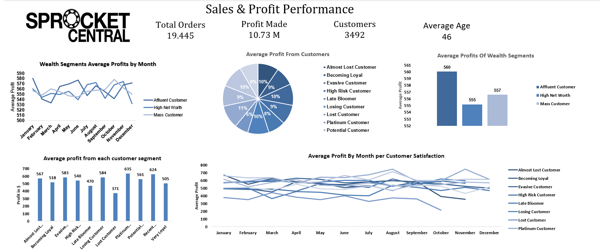
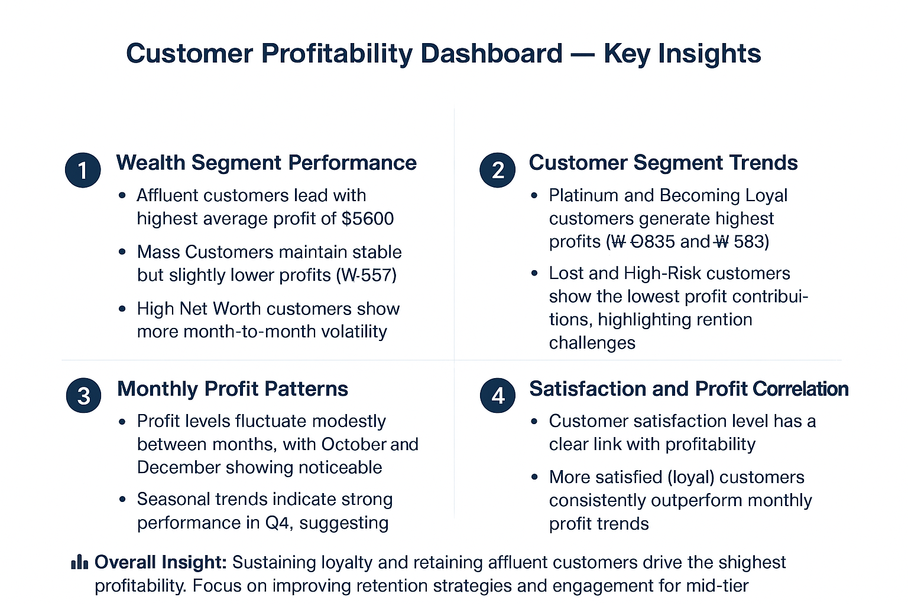

# 📊 Sprocket Central Customer Profitability Analysis (Excel Dashboard)

## Project Overview
This project analyzes customer profitability and segmentation for Sprocket Central using Microsoft Excel.  
The goal of the analysis was to identify which customer segments generate the most profit and understand how customer behavior impacts overall business performance.

The dashboard combines customer data, profit metrics, and segmentation analysis to provide insights into profitability patterns and customer value.

---

# Dataset
The dataset includes information about:

- Customer segments
- Customer satisfaction levels
- Monthly profits
- Customer demographics
- Order activity

The dataset was cleaned and structured using Excel before performing analysis.

---

# Key Metrics
The dashboard highlights several key performance indicators:

- **Total Orders:** 19,445
- **Total Profit:** $10.73M
- **Total Customers:** 3,492
- **Average Customer Age:** 46

---

# Dashboard Features

## Wealth Segment Performance
The dashboard compares profitability across customer wealth segments:

- Affluent Customers
- High Net Worth Customers
- Mass Customers

This helps identify which segments drive the most revenue.

---

## Customer Segment Analysis
Customers are categorized into behavioral groups such as:

- Platinum Customers
- Becoming Loyal
- Potential Customers
- High Risk Customers
- Lost Customers

This segmentation helps evaluate customer value and retention challenges.

---

## Monthly Profit Trends
Line charts show how profitability changes across months, helping identify seasonal patterns and performance fluctuations.

---

## Customer Profit Contribution
Charts visualize how different customer groups contribute to total profits, making it easier to prioritize high-value segments.

---

# Key Insights

### Wealth Segment Performance
- Affluent customers generate the highest average profit (~$5600).
- Mass customers provide stable but slightly lower profits.
- High Net Worth customers show more volatility across months.

### Customer Segment Trends
- Platinum and Becoming Loyal customers generate the highest profits.
- Lost and High-Risk customers contribute the least profit.

### Monthly Profit Patterns
- Profit levels fluctuate slightly across months.
- Stronger performance appears toward the end of the year (Q4).

### Customer Satisfaction Impact
- Higher customer satisfaction correlates with higher profitability.
- Loyal customers consistently outperform other segments.

**Overall Insight:**  
Maintaining customer loyalty and retaining affluent customers significantly improves profitability.

---

# Tools Used
- Microsoft Excel
- Pivot Tables
- Data Cleaning
- Data Visualization
- Dashboard Design

---

# Dashboard Preview

## Excel Dashboard

## Key Insights

---

# Skills Demonstrated
- Data Cleaning
- Customer Segmentation Analysis
- Pivot Table Analysis
- Business Insights Generation
- Dashboard Design
